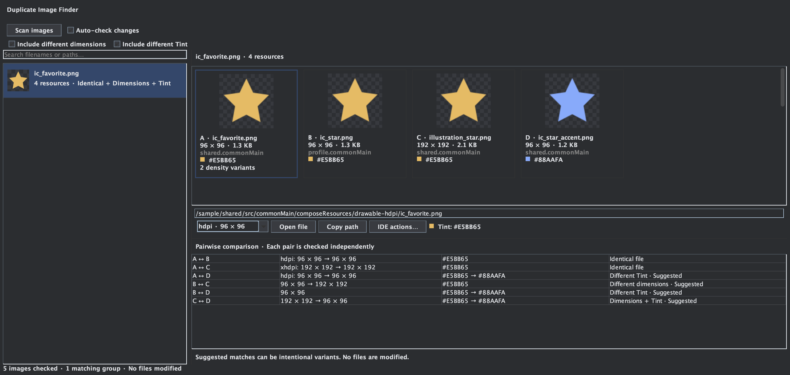

# Duplicate Image Finder

An Android Studio plugin for finding identical and similar static images in Android and Compose Multiplatform resource directories.



*Plugin panel rendered with sample resources and a dark palette.*

## Use

Install the ZIP from **Settings → Plugins → ⚙ → Install Plugin from Disk**, then open **View → Tool Windows → Duplicate Image Finder**.

By default, only identical files or decoded pixels with matching dimensions and density qualifiers are listed. Identical files across different density folders require **Include different dimensions**, because their resource display sizes differ. Enable **Include different dimensions** or **Include different Tint** to broaden the search. Both must be enabled for pairs that differ in both dimensions and Tint.

Normal density variants of the same resource (same resource root, name, folder type, and non-density qualifiers) are excluded. For example, `drawable-hdpi/icon.png` and `drawable-xhdpi/icon.png` in the same source set are not duplicates. When matching another resource, density variants share one card; use the density selector to inspect each original file. The pair table shows the strongest actual match and its density, rather than treating normal DPI differences as separate duplicates. Same-named files in different modules are still compared.

Select a group to compare thumbnails, original dimensions, file paths, and HEX colors. The pair table checks each relationship independently; belonging to the same group does not imply that every pair matches. Select a card to open its file, copy its path, or access native IDE actions.

Scans run in the background. The status bar shows the current stage, discovered image count, and percentage while reading images or comparing pairs. **Cancel** stops the scan and keeps previous results. Progress updates do not rebuild the result list.

**Auto-check changes** is enabled by default. Saved changes detected by the IDE trigger a debounced background scan, reusing cached image fingerprints. Copying an image to a new filename also triggers auto-check. New matching pairs produce a notification with a **View matches** action. The initial scan is silent. Settings are remembered per project.

## Scope

* Static PNG, JPEG, and WebP. Animated images and vector XML/SVG are not supported yet.
* Resized copies are heuristic matches with local transparency checks to distinguish internal cutouts; differently tinted **monochrome artwork** is compared by shape. Arbitrary photo recoloring, rotations, and crops are not detected reliably.
* Tint is shown as HEX with color swatches. Multicolor images show up to three main colors instead of a single Tint.
* Images can intentionally differ for density, accessibility, or small-size artwork. Results are suggestions, never deletion recommendations. This plugin does not modify files.
* Native Find Usages depends on the IDE's support for the selected file; generated Compose references may not be resolved.

Only images under `src/*/res/` and `src/*/composeResources/` are scanned across project modules. iOS asset catalogs, documentation images, IDE-excluded roots, hidden directories, build output, and common dependency directories are excluded. Limits: 2,000 images, 100,000 filesystem entries, 20,000 matching pairs, 32 MiB per image, and 16 million decoded pixels. The pair table shows the first 64 images of a large group. Limits and unreadable or unsupported images are reported under **Scan issues**.

## Build

Requires JDK 21 and Android Studio based on IntelliJ Platform 261 or later with its bundled WebP plugin.

```sh
./gradlew buildPlugin check
# Override the local IDE path if needed:
./gradlew buildPlugin -PstudioPath="/path/to/Android Studio.app"
```

Run `./gradlew runIde` to test in an isolated Android Studio sandbox with the plugin loaded. The installable ZIP is in `build/distributions/`. Checks cover exact copies, size and Tint combinations, filtering, non-transitive relationships, transparent pixels, malformed images, and static WebP decoding.

Apache License 2.0. Build setup adapted from [Animated WebP Viewer](https://github.com/dev-weiqi/animated-webp-viewer).
